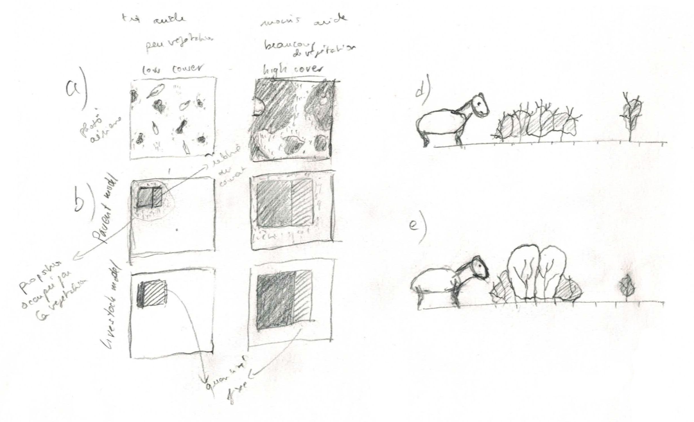

# conceptualisation of grazing models

## First draft

## Communication goal

The main messages of the conceptual figure should be:

1. *Grazing* is the plant loss caused by a certain amount of livestock. 
2. Grazing concerns a fixed amount of vegetation, not a proportion of vegetation
   - M0: grazing affects all plant individuals with a fixed probability
   - M1: grazing affects a fixed amount of total plants' biomass, independent of vegetation cover
3. Associative Protection
   - M0: grazing affects all plant individuals equally
   - M2: grazing affects outer parts of plants/patch more 